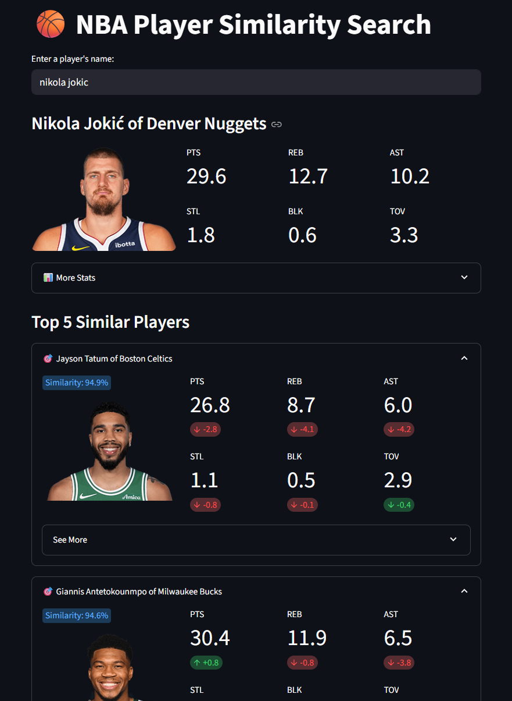

# 🏀 NBA Player Similarity Search (Streamlit App)
As an NBA fan, I’ve always been curious about how similar players really are — not just by eye test or role, but through actual stats. So I built this app to explore that question using a bit of deep learning magic.

This interactive Streamlit app lets you search for an NBA player and discover their top 5 most similar peers based on advanced metrics and per-36-minute stats, using a PyTorch autoencoder to learn player embeddings.

Simply enter a player’s name and explore their closest statistical matches — with charts, comparisons, and team info.

---

### 📸 Demo Preview



---

## 🚀 Features
- 🔍 Fuzzy Player Search with suggestions

- 🧠 Autoencoder-based Embedding of player stats

- 📊 Advanced Stats (TS%, PER, BPM, VORP, etc.)

- ⛹️ Per-36 Metrics for fair comparisons

- 🖼️ Player Headshots and Team Info

- 📈 Radar & Bar Charts comparing players

- 🧪 Built with torch, scikit-learn, nba_api, Streamlit, and plotly


---


## 📦 Installation
1. Create and activate a virtual environment:
``` 
uv venv
source .venv/bin/activate  # or .venv\Scripts\activate on Windows
```

2. Install dependencies with uv:
```
uv pip install -r requirements.txt
```

---

## ▶️ Running the App

```
streamlit run app.py
```

---

## 📁 Project Structure
```
nba-similarity/
├── app.py               # Main Streamlit app
├── pyproject.toml       # Dependency metadata for uv
├── requirements.txt     # Pinned dependencies
└── README.md            # You're here!
```

---

## 📊 How It Works
- Pulls current player stats from NBA API and Basketball Reference

- Standardizes numeric features and trains a PyTorch autoencoder

- Computes cosine similarity between player embeddings

- Presents similar players with rich visual and statistical comparison

---


## 🧠 Example Stats Used
- Points, Rebounds, Assists, Steals, Blocks, Turnovers

- TS% (True Shooting), USG%, PER, BPM, VORP

- PTS/AST/REB/etc. per 36 minutes


---


## 🛠️ Dependencies
- streamlit

- torch

- pandas

- numpy

- scikit-learn

- nba_api

- plotly


---

## 📌 Notes
The app scrapes live data from Basketball Reference — it may break if their structure changes.

This project uses @st.cache_data and @st.cache_resource to optimize loading and training.

---

## 📃 License
MIT License — feel free to use, fork, and contribute!

---


